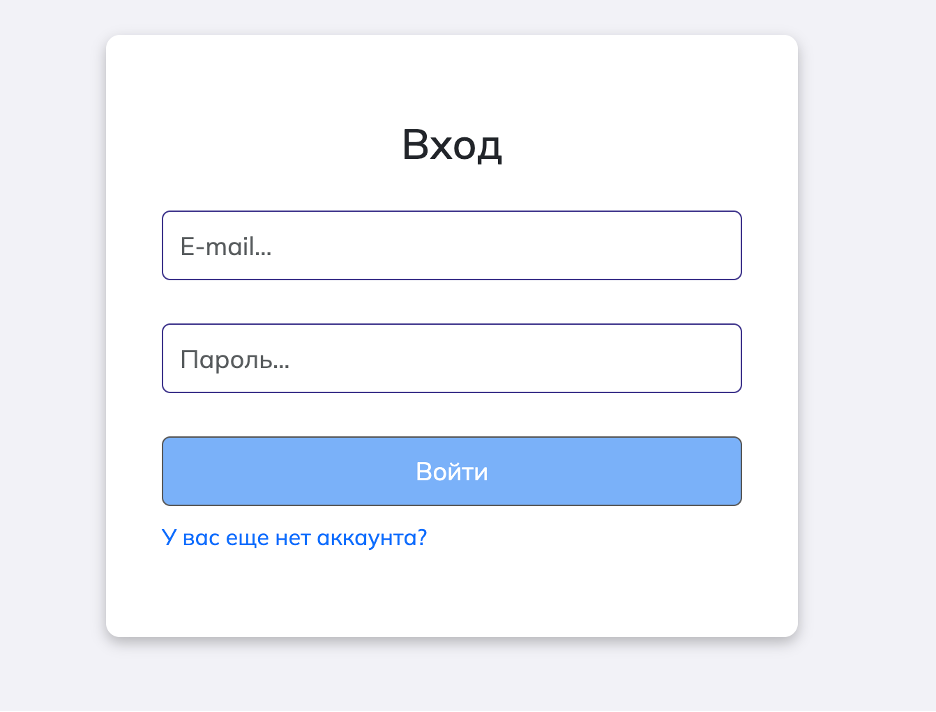
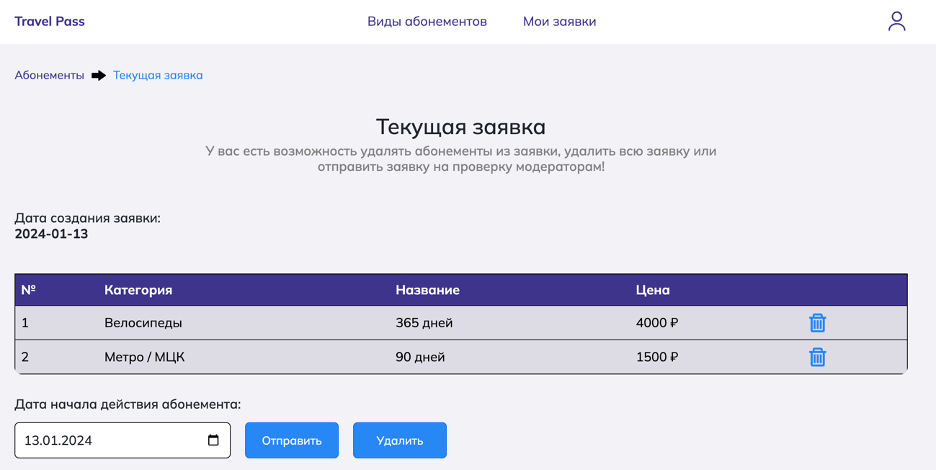

# Система для приобретения абонементов на транспорт (репозиторий Frontend)

## Ссылки

[Ссылка на Backend]

[Ссылка на нативное приложение]

Ограниченный функционал развернут на [Pages]

## Стек технологий

- Frontend: React, Typescript, Redux Toolkit, Vite, SCSS modules, Framer-motion, React Bootstrap.
- Backend: Django (ORM), PostgreSQL, Redis, S3 Minio.
- Нативное приложение: React Native, Typescript.

## Функционал приложения

- Просмотр главной страницы с основной информацией о приложении
- Просмотр доступных для приобретения абонементов (с возможностью добавления абонементов в заявку-корзину - только для авторизованных пользователей)
- Авториация и регистрация
- Просмотр текущей заявки-корзины
- Просмотр истории заявок конкретного пользователя
- Редактирование абонементов - доступно только для модераторов (сотрудников транспортной компании)
- Просмотр заявок всех пользователей, отклонении и принятие - доступно только для модераторов

## Экраны приложения

### Главная страница:

### Главная страница:

### Регистрация и вход

### Страница абонементов

### Страница одного абонемента

### Страница текущей заявки-корзины

### Страница истории заявок пользователя

### Окно профиля пользователя

### Страница администрировения (редактирования абонементов и категорий)

### Окно редактирования / создания абонемента

### Страница заявок всех пользователей

[Ссылка на Backend]: https://github.com/AshurovG/transport_subscriptions_back
[Ссылка на нативное приложение]: https://github.com/AshurovG/transport-subscriptions-native/tree/feature
[Pages]: https://ashurovg.github.io/transport_subscriptions_front/
